<!--
  This is your PROFILE README. It goes in a repo named exactly after your
  username (e.g. github.com/OCTOCAT/OCTOCAT) so GitHub shows it on your profile.
  Replace the ALL-CAPS placeholders. Widths 392/490 keep the portrait and info
  card the same height -- if you change either SVG's intrinsic W/H, re-match these
  (target width = other_H * this_intrinsic_W / this_intrinsic_H).
-->

<table>
<tr>
<td valign="top"></td>
<td valign="top"></td>
</tr>
</table>

## riveroangelsebas

**Junior Dev**

 

<!-- animated contribution graph, refreshed daily by the workflow -->

